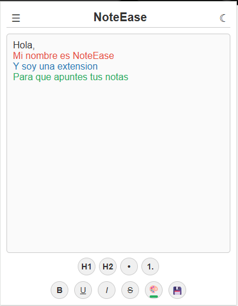
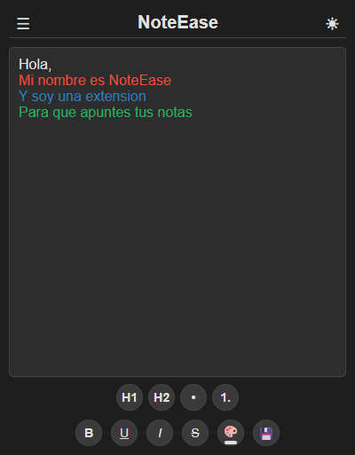

# NoteEase

Extensión de Chrome ligera para tomar notas rápidas directamente desde el toolbar del navegador. Sin cuentas, sin la nube, sin complicaciones — tus notas se guardan localmente en tu navegador.


## Funcionalidades

- **Editor de texto enriquecido** — Negrita, cursiva, subrayado, tachado
- **Formateo de bloques** — Headings (H1, H2), listas con viñetas y numeradas
- **Paleta de colores** — Rojo, azul, verde, negro/blanco con indicador visual
- **Múltiples notas** — Sidebar colapsable para crear, cambiar y eliminar notas
- **Exportar** — Como HTML (preserva formato) o TXT (texto plano)
- **Tema oscuro/claro** — Toggle con persistencia y contraste adaptativo
- **Atajos de teclado** — `Ctrl+B`, `Ctrl+I`, `Ctrl+U`
- **Guardado automático** — Cada cambio se persiste al instante via `chrome.storage.local`
- **Migración automática** — Actualiza desde v1.3 sin perder datos

## Capturas de pantalla

| Tema claro | Tema oscuro |
|:---:|:---:|
|  |  |

## Instalación

1. Descarga o clona este repositorio:
   ```bash
   git clone https://github.com/jraversbcn21/NoteEase.git
   ```
2. Abre `chrome://extensions/` en tu navegador
3. Activa **"Developer mode"** (esquina superior derecha)
4. Click en **"Load unpacked"** y selecciona la carpeta del proyecto

## Estructura del proyecto

```
NoteEase/
  manifest.json      — Configuración de la extensión (Manifest V3)
  popup.html         — UI del popup (editor + sidebar + toolbars)
  popup.js           — Orquestador: conecta UI con módulos
  formatting.js      — Motor de formateo (Selection/Range API)
  notes.js           — Gestión de múltiples notas (CRUD + migración)
  style.css          — Estilos con CSS custom properties (light/dark)
  icons/             — Iconos 16/48/128px
```

## Stack

- HTML / CSS / JavaScript vanilla (sin frameworks ni bundler)
- Chrome Extensions API (Manifest V3)
- `chrome.storage.local` para persistencia

## Permisos

| Permiso | Uso |
|---------|-----|
| `storage` | Guardar notas y preferencias (tema) localmente |

No se recopilan datos. No hay servidores. Todo queda en tu navegador.

## Atajos de teclado

| Atajo | Acción |
|-------|--------|
| `Ctrl + B` | Negrita |
| `Ctrl + I` | Cursiva |
| `Ctrl + U` | Subrayado |

## Licencia

MIT
